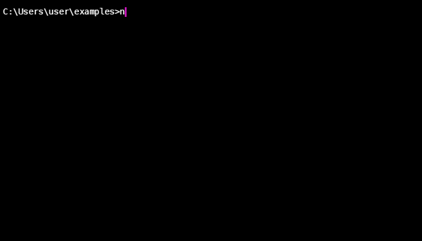

# vue-mods-names
> Simple adding class names mods to all components in your vue app



[](https://badge.fury.io/js/vue-mods-names)
[](https://travis-ci.org/RGRU/vue-mods-names)
[](https://standardjs.com)

Docs with examples and playgrounds:<br>
[English](https://rgru.github.io/vue-mods-names/#/)<br>
[Русский](https://rgru.github.io/vue-mods-names/#/ru/)<br>
[Українська](https://rgru.github.io/vue-mods-names/#/ua/)<br>
[français](https://rgru.github.io/vue-mods-names/#/fr/)<br>

## Install

So typically

```js
npm i vue-mods-names -D
```

## Usage
```js
import VueModsNames from 'vue-mods-names'

Vue.use(VueModsNames)
```
If you want to change prefix (by default is equal: `_`), then just pass it in plugin options, like this:
```js
import VueModsNames from 'vue-mods-names'

Vue.use(VueModsNames, { prefix: '-' })
```
After that any component in your app is ready to use mods. It will work if you declare name of base class in directive `v-mods-names:`

Declare behavior by adding special directive `v-mods-names` in your template. `good` - is name of base class, that will join with other mods.

`Good.vue`
```html
<!-- Template of 'Good' component, that will be include in other places -->
<div v-mods-names:good>It's cool</div>
```

Now we may use component with different mods:

`main page`
```html
<Good mods="main" />
```

In the issue you have component on main page, that has classes after render:

```html
<div class="good good_main">It's cool</div>
```

> All style modifications of component typically describe in component file itself (one file component).

```css
.good {}

.good_main {}

.good_big {}
```

You can pass Array of mods:

```html
<Good :mods="['main', 'big']" />
```

After render we get this:

```html
<div class="good good_main good_big">It's cool</div>
```

[KamilOcean](https://twitter.com/kamil_ocean)
